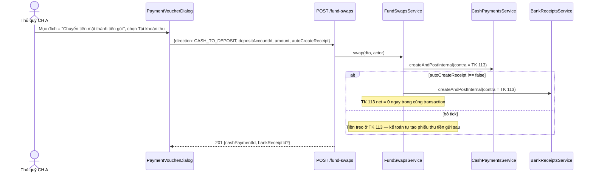
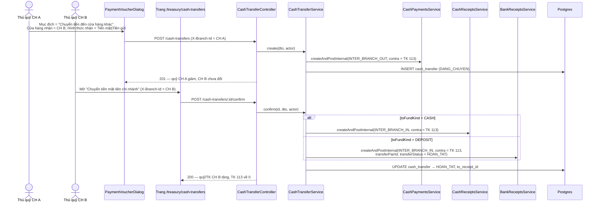
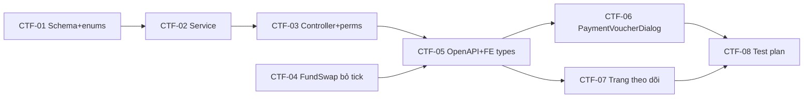

# EPIC-21072026 Phiếu chi tiền mặt — chuyển thành tiền gửi & chuyển đến cửa hàng khác

## Goal

Màn **Thu, chi tiền mặt** (`/treasury/cash/receipts-expenses`) hiện chỉ tạo được phiếu chi "Chi khác" và "Trả nợ". Hai mục đích chi còn lại — **"Chuyển tiền mặt thành tiền gửi"** và **"Chuyển tiền đến cửa hàng khác"** — đã khai báo sẵn trong `PaymentOtherSubOption` nhưng bị **lọc bỏ khỏi dropdown** (`PaymentVoucherDialog.tsx`) kèm comment "follow-up work", vì lúc đó chưa có cách book đúng tài khoản đích.

Hiện trạng backend trước epic này:

| Luồng | Trạng thái |
| ----- | ---------- |
| Tiền mặt → tiền gửi (cùng chi nhánh) | **Đã có** — `FundSwapsService.swap({direction: CASH_TO_DEPOSIT})`, 2 chân atomic qua TK 113 |
| Tiền gửi → tiền gửi (khác chi nhánh) | **Đã có** — `DepositTransferService`, 2 bước `DANG_CHUYEN` → `HOAN_TAT`/`DA_HUY` |
| Tiền mặt → tiền mặt / tiền gửi (khác chi nhánh) | **Chưa có gì** — không có `CashTransferService`, `CashPaymentPurpose` không có giá trị inter-branch |

Nên mục đích 1 chủ yếu là việc FE; mục đích 2 là BE mới + FE mới.

**Kết quả đo được:** từ "Thêm mới phiếu chi", chọn được 3 mục đích. Mục đích 2 giảm quỹ tiền mặt + tăng số dư tài khoản tiền gửi cùng chi nhánh (hoặc treo TK 113 nếu bỏ tick "Tự động sinh phiếu thu"). Mục đích 3 giảm quỹ tiền mặt CH A ngay, treo TK 113; CH B xác nhận thì tăng **quỹ tiền mặt** hoặc **tài khoản tiền gửi** của CH B tuỳ "Hình thức nhận".

## Scope

- **Entity mới:** `cash_transfer` (header chuyển tiền mặt liên chi nhánh, 2 branch scope from/to nên **không** extends `BaseEntity` — đúng như `DepositTransferEntity`). Dùng lại nguyên vẹn PG enum `deposit_transfer_status` + TS enum `DepositTransferStatus`; enum mới duy nhất là `cash_transfer_fund_kind` (`CASH` | `DEPOSIT`).
- **Enum bổ sung** (`cash-vouchers/enums.ts` + `ALTER TYPE ADD VALUE`): `CashPaymentPurpose` += `DEPOSIT_TRANSFER`, `INTER_BRANCH_OUT`; `CashReceiptPurpose` += `INTER_BRANCH_IN`; `CashPaymentReferenceType` / `CashReceiptReferenceType` += `TRANSFER`.
- **API surface:** endpoint riêng (không dùng generic CRUD — có vòng đời + 2 branch scope): `POST /cash-transfers`, `POST /cash-transfers/:id/confirm`, `POST /cash-transfers/:id/cancel`, `GET /cash-transfers`, `GET /cash-transfers/:id`.
- **Sửa code đã ship (tối thiểu):** `CashPaymentsService.reverse` nhận thêm `manager?: EntityManager`; `FundSwapsService` cho phép `autoCreateReceipt=false` ở chiều `CASH_TO_DEPOSIT`.
- **Events:** không phát/tiêu thụ event mới. Mọi bút toán đi qua `createAndPostInternal` sẵn có.
- **FE surface:** `backoffice-web` — `PaymentVoucherDialog` (2 sub-mode) + trang mới `/treasury/cash-transfers` (theo dõi + xác nhận + huỷ).

## Success Metrics

- Dropdown "Mục đích chi" của phiếu chi tiền mặt có đủ 3 lựa chọn; không còn nhánh code bị `filter` ẩn đi.
- "Chuyển tiền mặt thành tiền gửi" giữ tick → `cash_payments` +1 và `bank_receipts` +1, quỹ tiền mặt giảm, số dư tiền gửi tăng đúng số tiền.
- Cùng thao tác nhưng **bỏ tick** → chỉ `cash_payments` +1, số dư tiền gửi không đổi, dư nợ TK 113 tăng.
- "Chuyển tiền đến cửa hàng khác" → `cash_transfer` status `DANG_CHUYEN`, quỹ CH A giảm ngay, quỹ/TK CH B **chưa** đổi.
- CH B xác nhận → status `HOAN_TAT`, đúng một chân thu được tạo (`cash_receipts` nếu Thu tiền mặt, `bank_receipts` purpose `INTER_BRANCH_IN` nếu Thu tiền gửi).
- CH A huỷ khi còn `DANG_CHUYEN` → `cash_payments` bị đảo, quỹ CH A hoàn nguyên, status `DA_HUY`.
- Chi nhánh sai thao tác → 403 rõ ràng (CH A không xác nhận được, CH B không huỷ được).
- Migration chạy sạch trên DB đang có dữ liệu; phiếu chi cũ vẫn hiển thị đúng nhãn.

## Flows

### Chuyển tiền mặt thành tiền gửi (cùng chi nhánh, tái dùng `/fund-swaps`)

### Chuyển tiền đến cửa hàng khác (2 bước, có xác nhận)

## Tickets

- [TKT-CTF-01 Schema + enum values](../tickets/TKT-CTF-01-schema-enums.md)
- [TKT-CTF-02 CashTransferService + DTOs](../tickets/TKT-CTF-02-cash-transfer-service.md)
- [TKT-CTF-03 Controller + permissions](../tickets/TKT-CTF-03-controller-permissions.md)
- [TKT-CTF-04 FundSwaps — bỏ tick chiều CASH_TO_DEPOSIT](../tickets/TKT-CTF-04-fund-swap-optional-receipt-cash.md)
- [TKT-CTF-05 OpenAPI regen + FE types/hooks](../tickets/TKT-CTF-05-openapi-fe-types-hooks.md)
- [TKT-CTF-06 PaymentVoucherDialog — 2 sub-mode](../tickets/TKT-CTF-06-payment-dialog-submodes.md)
- [TKT-CTF-07 Trang Chuyển tiền mặt liên chi nhánh](../tickets/TKT-CTF-07-cash-transfer-page.md)
- [TKT-CTF-08 Test plan](../tickets/TKT-CTF-08-tests.md)

## Dependencies

- Depends on: `cash-vouchers` + `deposit-vouchers` (đã ship), `DepositTransferService` (mẫu vòng đời 2 bước), `FundSwapsService` (mẫu compose 2 chân qua TK 113), EPIC-19072026 Fund swap optional receipt (mẫu checkbox thật).
- Reuses: `CashFundResolverService` (`resolveOrDefault`, `resolveBranchCashFund`, `resolveCoaAccountIdByCode`), `resolvePartySnapshot`/`partySnapshotFromVoucher` (`cash-vouchers/shared/voucher-party.ts`), `DocumentNumberingService` (qua `createAndPostInternal`), `GET /branches` + `GET /deposit/dashboard` cho 2 picker FE, `IdempotencyInterceptor` toàn cục.
- Không đụng: `cash_movements` (không thêm cột transfer — trạng thái sống ở `cash_transfer`), generic CRUD platform.

### Ticket dependency graph

