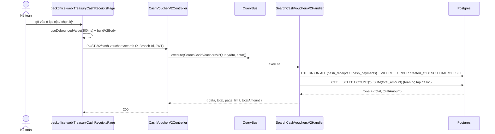
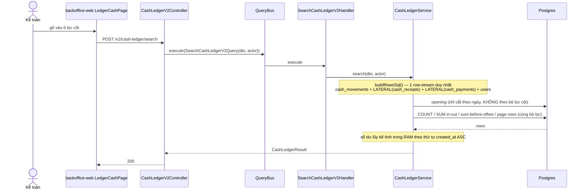
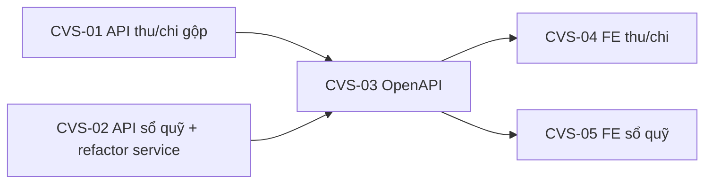

# EPIC-21072026 Tiền mặt — gộp 1 API tìm kiếm thu/chi + lọc theo cột cho sổ quỹ

## Goal

Hai màn tiền mặt vẫn còn xử lý phía trình duyệt, trong khi phía tiền gửi (deposit) đã chuyển hết
sang server ở commit `b4bf7907`:

- **`/treasury/cash/receipts-expenses`** gọi **2 API** (`GET /cash-receipts` + `GET /cash-payments`,
  mỗi cái `pageSize=100`), gộp trên trình duyệt (`useMergedReceiptPayments`), rồi **lọc / sắp xếp /
  phân trang / cộng tổng trong RAM**. Hệ quả: mọi bộ lọc cột và ô "Tổng tiền" chỉ nhìn thấy 100
  phiếu thu + 100 phiếu chi đầu tiên; trang 2 của dữ liệu thật là sai âm thầm.
- **`/treasury/cash/ledger`** phân trang server nhưng **không có bộ lọc cột nào**
  (`filterKind: "none"`), vì `description` / `counterparty` được resolve **sau** truy vấn trang
  bằng một Map JS (`CashLedgerService.loadVouchers`) nên không thể lọc trong SQL.

Đưa cả hai về đúng mô hình deposit: **một API cho mỗi màn**, lọc + sắp xếp + phân trang + tổng tiền
đều chạy ở DB trên **toàn bộ** tập dữ liệu.

Measurable outcome: `/treasury/cash/receipts-expenses` gọi đúng **1** request
`POST /v2/cash-vouchers/search`; ô "Tổng tiền" = `SUM(total_amount)` toàn bộ tập đã lọc (không phải
tổng của trang); `/treasury/cash/ledger` lọc được theo Ngày / Số phiếu / Diễn giải / Đối tượng /
Số tiền thu / Số tiền chi ngay trên server.

## Decisions (locked)

- **Cột ngày = `created_at`.** Cột ngày của lưới chuyển từ `voucher_date` sang `created_at`
  ("Ngày tạo"); bộ lọc khoảng ngày **và** thứ tự sắp xếp đều dùng `created_at`
  (`ORDER BY created_at DESC, id DESC`). ⚠️ **Đổi hành vi:** bộ lọc kỳ (period) từ nay lọc theo thời
  điểm tạo, nên phiếu ghi lùi ngày về tháng trước nhưng tạo hôm nay sẽ nằm trong "tháng này".
  Khác deposit (deposit lọc `doc_date`, chỉ *sắp xếp* theo `created_at`).
- **Sổ quỹ tiền mặt làm đầy đủ** — thêm `POST /v2/cash-ledger/search`, kéo theo việc chuyển phần
  resolve chứng từ/đối tượng từ `loadVouchers` (JS) vào SQL `LEFT JOIN LATERAL`.
- **`documentKind` có 3 giá trị**: `CASH_RECEIPT` / `CASH_PAYMENT` / `GOODS_RECEIPT_PAYMENT`
  (giá trị thứ ba suy ra từ `cash_payments.reference_type = 'GOODS_RECEIPT'`), khớp đúng 3 nhãn cột
  "Loại chứng từ" đang render.
- **`documentNumber` cũng lọc được** (ngang bằng màn deposit).
- **Không migration.** Không đổi schema; mọi cột đã có sẵn.
- **Không thêm permission key.** Dùng lại `accounting.cash_receipt.read` và
  `accounting.cash_ledger.read` (đã có ở `permissions.seed.ts`) — key mới sẽ làm 403 mọi role hiện có.

## Scope

- **API (thêm 2 endpoint đọc, không thêm bảng):**
  `POST /v2/cash-vouchers/search` (CQRS, UNION ALL CTE trên `cash_receipts` + `cash_payments`) và
  `POST /v2/cash-ledger/search` (CQRS, handler mỏng ủy quyền cho `CashLedgerService`).
- **Refactor:** `CashLedgerService` — một hàm dựng row-stream SQL dùng chung cho cả 5 entry point
  (opening / count / sum in-out / sum-before-offset / page rows), chứng từ + nhân viên resolve bằng
  `LEFT JOIN LATERAL`. `GET /cash-ledger` (v1) trở thành adapter mỏng gọi cùng code.
- **Events:** không đổi. Đây là endpoint chỉ-đọc.
- **FE (backoffice-web):** 2 trang `TreasuryCashReceiptsPage` + `LedgerCashPage` chuyển sang
  lọc/phân trang phía server; xóa `use-merged-receipt-payments.ts` và các adapter chết theo.
- Mọi identifier/column/enum/log/swagger backend English.

## Success Metrics

- Màn thu/chi: **1** request mỗi lần lọc; `total` và `totalAmount` lấy từ response, đúng trên toàn
  tập dữ liệu (không giới hạn 100+100).
- Lọc "Loại chứng từ" = *Phiếu nhập hàng - Tiền mặt* chỉ trả về phiếu chi có
  `reference_type = 'GOODS_RECEIPT'`.
- Sổ quỹ: lọc theo Diễn giải / Đối tượng chạy ở SQL; số dư lũy kế vẫn đúng khi sang trang 2+.
- `GET /cash-ledger` (v1) trả kết quả **không đổi** so với trước refactor cho cùng tham số — đây là
  cổng chặn hồi quy của việc refactor service.
- Không rò rỉ chéo tenant: mọi truy vấn scope `organization_id` (+ `branch_id`).

## Flows

### Màn thu/chi tiền mặt — gộp 1 API

### Sổ quỹ tiền mặt — lọc theo cột trên server

## Tickets

- [TKT-CVS-01 BE: `POST /v2/cash-vouchers/search` (CQRS + UNION ALL CTE)](../tickets/TKT-CVS-01-cash-voucher-search-api.md)
- [TKT-CVS-02 BE: refactor `CashLedgerService` + `POST /v2/cash-ledger/search`](../tickets/TKT-CVS-02-cash-ledger-search-api.md)
- [TKT-CVS-03 OpenAPI regen + snapshot](../tickets/TKT-CVS-03-openapi-snapshot.md)
- [TKT-CVS-04 FE: màn Thu, chi tiền mặt dùng search server-side](../tickets/TKT-CVS-04-fe-receipts-expenses.md)
- [TKT-CVS-05 FE: sổ quỹ tiền mặt lọc theo cột](../tickets/TKT-CVS-05-fe-cash-ledger.md)

## Dependencies

- Depends on: EPIC-18052026 (Cash vouchers), EPIC-15072026 GĐ1–GĐ4 (Deposit Fund — nguồn tham chiếu
  `search-deposit-vouchers-v2.*`, `deposit-ledger.service.ts`, `LedgerDepositPage`).
- Reuses:
  - `common/filters/filter.dto.ts` — `StringFilterDto` / `EnumFilterDto` / `DateRangeFilterDto` /
    `CompareFilterDto`.
  - Permission `accounting.cash_receipt.read`, `accounting.cash_ledger.read` (đã seed).
  - FE: `buildV2Body` / `V2SearchConfig` (`components/crud/crudV2Search.ts`), `useDebouncedValue`,
    `columnFilterControl` của `BaseDataTable`, `DocumentListShell`, `PaginationControls`.

### Ticket dependency graph

## Out of scope

- Không đổi luồng ghi (tạo/sửa/xóa/đảo phiếu) — CQRS ở repo này chỉ dùng cho query.
- Không bỏ `GET /cash-receipts` / `GET /cash-payments` / `GET /cash-ledger` (v1 vẫn dùng cho form
  chi tiết, nhân bản, và các màn khác).
- Không thêm cột "Số tài khoản" vào lưới tiền mặt (một két/chi nhánh).
- Không thêm đối chiếu (recon) cho tiền mặt — chỉ tiền gửi có.
- Không sửa `receiptPaymentToLedgerRow` (code chết **trước** epic này, chỉ ghi nhận).
