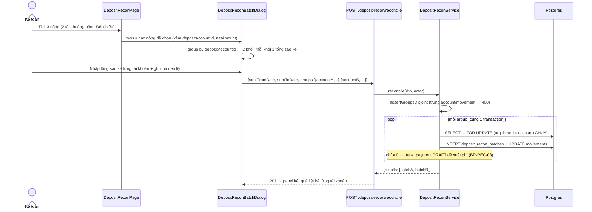
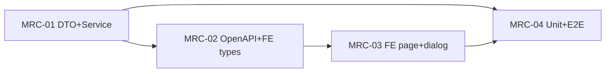

# EPIC-21072026 Đối chiếu tiền gửi — cho phép chọn nhiều tài khoản trong một lần đối chiếu

## Goal

Ở màn `/treasury/deposit-reconciliation`, khi filter "Số tài khoản" = **Tất cả** (mặc định), nút **"Đối chiếu"** luôn xám dù đã tick dòng — `DepositReconPage.tsx` disable nút bằng `|| !accountId`, và tooltip giải thích cũng không hiện được (`PageToolbar` đặt `disabled:pointer-events-none` nên `title` trên button disabled bị nuốt). Người dùng không bấm được, cũng không biết vì sao.

Ràng buộc "phải chọn 1 tài khoản" tồn tại vì `ReconcileDto` chỉ nhận **một** `depositAccountId` cho cả lô, trong khi `deposit_recon_batches` là 1 dòng/1 tài khoản.

Mục tiêu: chọn lẫn dòng của nhiều tài khoản vẫn đối chiếu được — BE nhóm movements theo `depositAccountId` và tạo **N lô** trong **một** transaction; dialog nhập tổng sao kê **riêng cho từng tài khoản** (mỗi sao kê thuộc đúng một ngân hàng).

**Kết quả đo được:** để filter "Tất cả", tick 3 dòng thuộc 2 tài khoản → nút "Đối chiếu" sáng → dialog hiện 2 khối tài khoản → xác nhận → 2 `deposit_recon_batches` được tạo, cả 3 movements chuyển khỏi trạng thái `CHUA`.

## Scope

- **Không entity/migration mới.** `deposit_recon_batches` giữ nguyên 1 lô = 1 `deposit_account_id`.
- `ReconcileDto` đổi sang shape duy nhất `{ groups[], stmtFromDate, stmtToDate }` (bỏ shape phẳng cũ — consumer duy nhất là màn này + 2 file test trong repo). `stmtTotalAmount`/`note` theo từng group.
- `DepositReconService.reconcile()` tách thành `reconcileGroup()` (logic cũ, nguyên vẹn) + vòng lặp trong 1 transaction. Một group fail → rollback toàn bộ, không có lô nửa vời.
- FE: bỏ điều kiện `!accountId`, state chọn dòng đổi `Set<string>` → `Map<string, row>` (cần `depositAccountId`/`netAmount` của cả dòng ngoài trang hiện tại), `DepositReconBatchDialog` render một khối nhập liệu cho mỗi tài khoản.
- Ngoài scope: sửa `disabled:pointer-events-none` trong `packages/ui/page-toolbar.tsx` (tooltip trên button disabled không hiện) — lý do disable còn lại sau fix đều hiển nhiên.

## Success Metrics

- Filter "Tất cả" + tick dòng ở trạng thái "Chưa đối chiếu" → nút "Đối chiếu" sáng (bug gốc).
- 3 dòng / 2 tài khoản → 2 lô, mỗi lô có `batch_number` riêng, `system_total_amount` = Σ `net_amount` đúng của tài khoản đó.
- Một group lệch + có ghi chú → lô đó `DISCREPANCY` + `bank_payments` DRAFT đề xuất phí; group còn lại `RECONCILED`, số dư quỹ không đổi (BR-REC-03).
- Một group lệch mà thiếu ghi chú → 400 và **không** lô nào được ghi (BR-REC-02 + rollback).
- Chọn dòng ở trang 1 rồi sang trang 2 chọn thêm → tổng "Đã chọn" và payload gửi đi tính đủ cả 2 trang.

## Flows

## Tickets

- [TKT-MRC-01 ReconcileDto groups[] + service tạo N lô](../tickets/TKT-MRC-01-reconcile-dto-service-groups.md)
- [TKT-MRC-02 OpenAPI regen + FE types](../tickets/TKT-MRC-02-openapi-fe-types.md)
- [TKT-MRC-03 FE page + dialog nhiều tài khoản](../tickets/TKT-MRC-03-fe-page-dialog-multi-account.md)
- [TKT-MRC-04 Unit + E2E](../tickets/TKT-MRC-04-tests-e2e.md)

## Dependencies

- Depends on: EPIC-15072026 (nền tảng quỹ tiền gửi — `deposit-recon` module, TKT-DFR-02/08/09 đã ship).
- Reuses: `DocumentNumberingService` (`DocumentType.RECONCILIATION`), `DepositAuditService`, `BankPaymentsService.createDraftInternal`, permission `accounting.deposit_recon.reconcile` (không seed mới), `IdempotencyInterceptor` toàn cục.

### Ticket dependency graph

