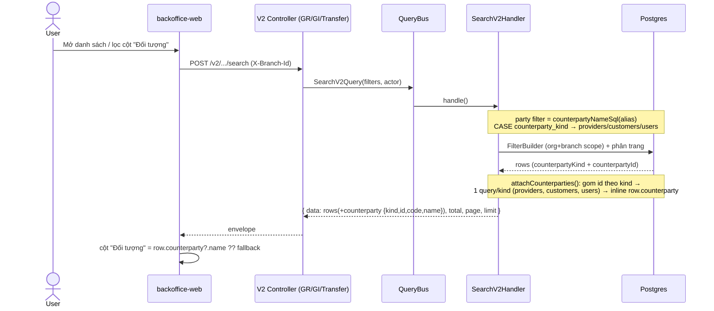
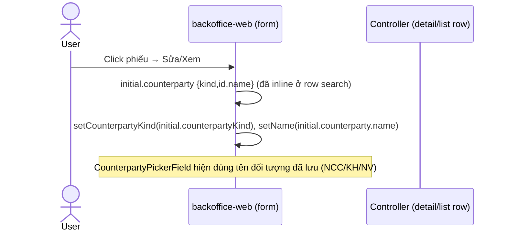
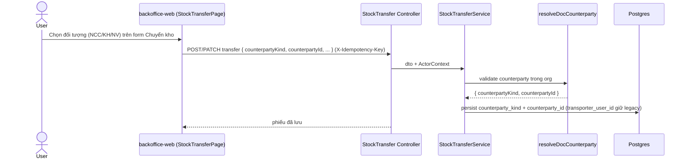
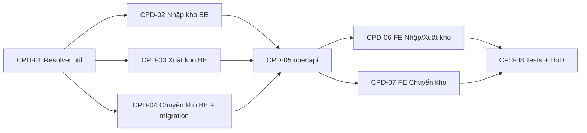

# EPIC-22062026 Hiển thị "Đối tượng" (NCC / Khách hàng / Nhân viên) trên Nhập / Xuất / Chuyển kho

## Summary

Sau khi redesign picker "Chọn đối tượng" ([EPIC-21062026 Counterparty picker redesign](./EPIC-21062026-counterparty-picker-redesign.md)), người dùng có thể chọn **đối tượng** thuộc 3 loại: **Nhà cung cấp** (`supplier`), **Khách hàng** (`customer`), **Nhân viên** (`employee`). Dữ liệu được lưu **đúng** (`counterparty_kind` + `counterparty_id`) nhưng **không hiển thị lại** trên danh sách và khi mở lại phiếu khi đối tượng không phải supplier — cột "Đối tượng" hiện `—` (Image #2: NK000011 chọn khách hàng → `—`).

**Root cause**: các CQRS v2 search handler chỉ join `provider` và đọc `provider.name` cho cột Đối tượng. Với `customer`/`employee`, `provider_id` là `NULL` (xem `resolveDocCounterparty`) nên tên không resolve được → FE nhận `provider = null` → render `—`. Không có quan hệ join tới `customers` / `users` để lấy tên theo `counterparty_id`.

Epic này **không sửa lưu trữ** (đã đúng) mà sửa **resolve + hiển thị tên đối tượng** cho cả 3 loại, trên **Nhập kho** + **Xuất kho** (chỉ thay đổi resolve/display), và **mở rộng Chuyển kho** để cũng có đối tượng (Chuyển kho hiện chưa có cột counterparty — cột "Đối tượng" đang là **Người vận chuyển**; theo yêu cầu sẽ đổi sang picker "Chọn đối tượng" như Nhập/Xuất kho).

Quyết định đã chốt (Step 1):
- **Chuyển kho**: đổi cột "Đối tượng" từ transporter sang **picker counterparty** (NCC / KH / NV) → **cần migration** thêm 2 cột `counterparty_kind` + `counterparty_id` vào `stock_transfers`. **Giữ** cột `transporter_user_id` (không drop — dữ liệu cũ + fallback hiển thị cho phiếu legacy).
- **Cả 3 loại** (supplier + customer + employee) đều resolve & hiển thị tên, ở **danh sách** lẫn **mở lại phiếu** (edit form rehydrate picker).
- **Resolve theo convention dự án**: SQL fragment (CASE + correlated subquery) chỉ dùng cho **filter cột Đối tượng** (chạy trước phân trang, server-side); **tên hiển thị** resolve bằng batch query JS rồi **inline** object `counterparty { kind, id, code, name }` vào từng row (mirror cách `transporter` đang được inline) — không trả root `{[id]: X}` map.

**Out of scope**:
- Thay đổi flow lưu đối tượng / `resolveDocCounterparty` (đã đúng cho cả 3 loại).
- Form Thêm mới/Sửa của Nhập/Xuất kho (picker đã wired ở EPIC-21062026; chỉ fix rehydrate tên khi mở lại).
- Bút toán nợ/có theo loại đối tượng (customer/employee không sinh nợ NCC — giữ nguyên hành vi hiện tại).
- Drop cột `transporter_user_id` của transfer.

## Flows

### Resolve + hiển thị Đối tượng trên danh sách (cả 3 loại)

### Mở lại phiếu (rehydrate picker)

### Chuyển kho — thêm đối tượng (create/update)

## Success Metrics

- Tạo phiếu Nhập kho với **Khách hàng** → danh sách + mở lại phiếu hiện **tên khách hàng** (không còn `—`). Tương tự với **Nhân viên** và **NCC**.
- Lọc cột "Đối tượng" (operator `*` contains) khớp đúng cho cả 3 loại, query **toàn bộ** dataset (không chỉ trang đã tải), scope `organizationId` + `branchId`.
- Áp dụng đồng nhất cho **Nhập kho**, **Xuất kho**, **Chuyển kho**.
- Chuyển kho: phiếu **legacy** (chưa có counterparty) vẫn hiển thị tên **Người vận chuyển** (fallback) — không regression.
- Không thêm query N+1: tên resolve theo batch (≤ 1 query/kind/trang).

## Tickets trong epic

| Ticket                                                                       | Mô tả ngắn                                                                                       |
| ---------------------------------------------------------------------------- | ------------------------------------------------------------------------------------------------ |
| [TKT-CPD-01](../tickets/TKT-CPD-01-be-counterparty-resolver.md)              | BE: util dùng chung — `counterpartyNameSql(alias)` (filter) + `attachCounterparties()` (inline)  |
| [TKT-CPD-02](../tickets/TKT-CPD-02-be-goods-receipt-resolve.md)              | BE: Nhập kho — wire resolver vào search-v2 + detail; trả `counterparty` per row                  |
| [TKT-CPD-03](../tickets/TKT-CPD-03-be-goods-issue-resolve.md)                | BE: Xuất kho — wire resolver vào search-v2 (giữ fallback targetBranch) + detail                  |
| [TKT-CPD-04](../tickets/TKT-CPD-04-be-transfer-counterparty.md)              | BE: Chuyển kho — migration + entity + DTO + service + search-v2 (fallback transporter)           |
| [TKT-CPD-05](../tickets/TKT-CPD-05-openapi-regen.md)                         | `pnpm openapi:generate` + commit snapshot (`counterparty` response + transfer DTO v2 fields)     |
| [TKT-CPD-06](../tickets/TKT-CPD-06-fe-receipt-issue-display.md)              | FE: Nhập/Xuất kho — cột "Đối tượng" đọc `row.counterparty.name` + rehydrate picker khi mở lại    |
| [TKT-CPD-07](../tickets/TKT-CPD-07-fe-transfer-picker.md)                    | FE: Chuyển kho — thay transporter bằng `CounterpartyPickerField`, gửi + hiển thị counterparty    |
| [TKT-CPD-08](../tickets/TKT-CPD-08-tests-and-dod.md)                         | Handler/util spec (3 loại) + e2e + DoD gate                                                      |

## Graph phụ thuộc ticket

## Dependencies (epic-level)

- Requires [EPIC-21062026 Counterparty picker redesign](./EPIC-21062026-counterparty-picker-redesign.md) — `CounterpartyPickerField`/`useCounterpartySearch`, `counterparty_kind`/`counterparty_id` đã có trên Nhập/Xuất kho + `resolveDocCounterparty` (3 loại).
- Requires [EPIC-09062026 Danh sách Chuyển kho v2](./EPIC-09062026-stock-transfer-list-v2.md) — `SearchStockTransfersV2Handler` + inline `transporter` (mirror cách inline `counterparty`).
- **Reuses**:
  - `resolveDocCounterparty` (`modules/inventory/location/services/resolve-doc-counterparty.util.ts`), `DocCounterpartyKind` (`@erp/shared-interfaces`).
  - `FilterBuilder` (`common/filters/`), `QueryBus` / `@nestjs/cqrs`.
  - Enum DB `doc_counterparty_kind_enum` đã tồn tại (transfer migration chỉ ADD COLUMN, không tạo enum).
  - FE: `CounterpartyPickerField` / `CounterpartyPickerModal` / `useCounterpartySearch`; `BaseDataTable` column filters; global `IdempotencyInterceptor`.

## Epic acceptance criteria

- [ ] Nhập kho / Xuất kho / Chuyển kho: cột "Đối tượng" hiện đúng tên cho **supplier + customer + employee**; mở lại phiếu picker hiện đúng đối tượng đã lưu.
- [ ] Filter cột "Đối tượng" (`*` contains) query toàn dataset cho cả 3 loại, scope org+branch.
- [ ] Mỗi row search trả `counterparty { kind, id, code, name }` inline (không root map); resolve batch ≤ 1 query/kind/trang.
- [ ] Chuyển kho: migration thêm `counterparty_kind` + `counterparty_id`; phiếu legacy fallback hiển thị transporter.
- [ ] `resolveDocCounterparty` validate đối tượng tồn tại trong org khi lưu (idempotent qua interceptor sẵn có).

## Epic Definition of Done

- [ ] Mọi ticket TKT-CPD-01–08 đạt DoD riêng.
- [ ] `pnpm --filter @erp/api test` + `lint` xanh; FE `tsc` xanh.
- [ ] `pnpm openapi:generate` cập nhật snapshot + `schema.ts` (transfer DTO v2 + `counterparty` shape).
- [ ] Không Vietnamese trong source BE (errors/comments/Swagger/logs); UI strings FE tiếng Việt.
- [ ] Không regression: phiếu supplier hiện tại vẫn đúng; transfer legacy vẫn hiện transporter; goods-issue TRANSFER_OUT vẫn fallback targetBranch.
- [ ] `synchronize` vẫn false; chỉ 1 migration cho transfer.
