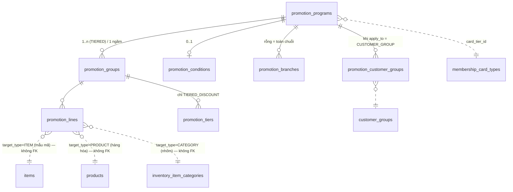
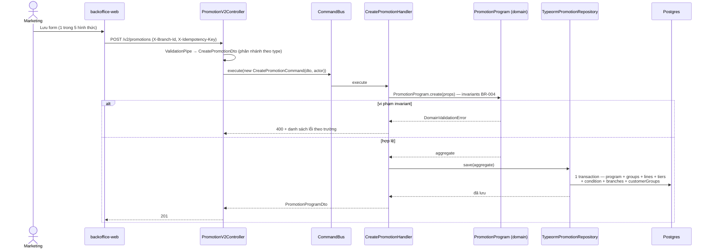
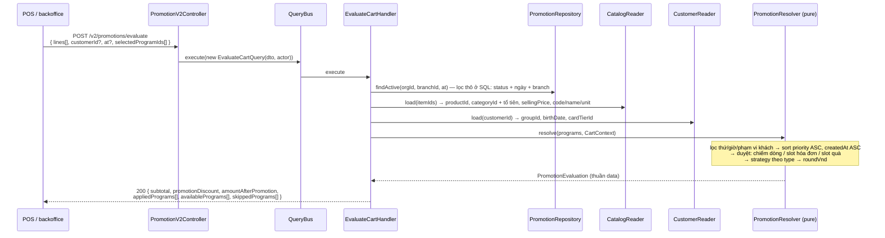
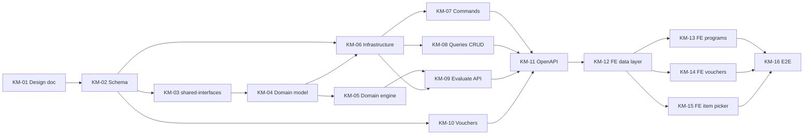

# EPIC-22072026 Khuyến mại — schema chuẩn hóa, domain engine & evaluate API

## Goal

`docs/promotions/` (REQ-KM-001 + khảo sát MISA eShop) đặc tả **5 hình thức khuyến mại**. Repo hiện lệch khỏi đặc tả đó theo hai hướng ngược nhau:

| Tầng | Hiện trạng |
| ---- | ---------- |
| FE backoffice | **Khung đã dựng xong** — `apps/backoffice-web/src/pages/promotions/programs/ProgramFormPage/PromotionVariant/` có 5 variant theo hình thức (`PromotionInvoiceDiscount`, `PromotionProductDiscount`, `PromotionTieredDiscount`, `PromotionGift`, `PromotionBuyGet`), mỗi variant nhận `{ form, onChange }` và compose section từ `_PromotionSections/` (`GeneralInfoPromotionSection`, `TimePromotionSection`, `StoreScopePromotionSection`, `ApplyScopePromotionSection`, `DiscountPromotionSection`, `GoodsDiscountPromotionSection`, `TieredDiscountPromotionSection`, `GiftPromotionSection`, `BuyGetPromotionSection`, `ConditionPromotionSection`, `AutoApplyCheckbox`). Route trong `App.tsx` đã có; `NavChild` trong `navConfig.ts` mới bật mục CTKM, mục voucher đang comment. Nhưng: (1) **chạy hoàn toàn trên mock** (`_mock/mock-programs.ts`, `_mock/mock-vouchers.ts`); (2) `ProgramFormPage.tsx` **chỉ render `PromotionInvoiceDiscount`**, không đọc `?type=` — 4 variant kia đã dựng nhưng chưa wire, 4/5 option trong `PROMOTION_FORM_OPTIONS` (`programs.constants.ts`) đang comment; (3) `handleSave` build payload qua `buildInvoiceDiscountPayload(form)` rồi chỉ `console.log` + toast + `navigate()`, chưa gọi API. |
| BE | **Stub** — `promotions` lưu `conditions`/`benefits` dạng `jsonb` không kiểu (`promotion.entity.ts:20-24`). `PromotionApplyService.computePromotionAmount` (`promotion-apply.service.ts:233-245`) chỉ hiểu `percentage` / `discount_amount` phẳng trên `subtotal` và **trả về `0` cho mọi promotion `gift_product` / `buy_x_get_y`**. Không có bậc thang, không có giảm giá cấp dòng, không có quà tặng, không có khái niệm ưu tiên. |

`ProgramFormState` trong `pages/promotions/programs/program-form.types.ts` chính là **contract backend phải đáp ứng**.

Epic này đóng khoảng cách ở backend: schema chuẩn hóa, domain engine thuần TS tính đúng cả 5 hình thức, `POST /v2/promotions/evaluate` để client xem trước kết quả, và gỡ mock ở backoffice.

**Kết quả đo được:** tạo được cả 5 hình thức từ backoffice, lưu → mở lại round-trip đúng từng trường; `evaluate` trả về đúng số tiền giảm đối chiếu tay cho AC-01…AC-09 của REQ; hai CTKM chồng lấn cùng SKU cho ra CTKM `priority` nhỏ hơn thắng, CTKM thua xuất hiện trong `skippedPrograms` kèm lý do.

## Scope

- **Entity mới (7 bảng):** `promotion_programs`, `promotion_groups`, `promotion_lines`, `promotion_tiers`, `promotion_conditions`, `promotion_branches`, `promotion_customer_groups`. Scope `ORGANIZATION`; phạm vi chi nhánh nằm ở bảng nối `promotion_branches` (rỗng = toàn chuỗi) → chốt BR-005.
- **Bảng `promotions` cũ:** **không đụng tới**. `PromotionApplyService` / `promotion.controller.ts` / `discount_codes` / `invoice_promotions` giữ nguyên tại chỗ. Drop bảng cũ là migration riêng sau khi xác nhận hết dữ liệu.
- **API surface:** controller v2 riêng, **không** dùng generic CRUD (aggregate 7 bảng + validate theo `type` + engine — vượt xa `BaseCrudService`). Search dùng `FilterBuilder` sẵn có.
- **Events:** không phát, không tiêu thụ event nào. Chưa có consumer nào cần → không thêm topic.
- **FE surface:** `backoffice-web` — gỡ mock ở `ProgramsPage`, `ProgramFormPage`, `VouchersPage`; dialog chọn hàng hóa (FR-024) nối vào catalog thật.

### Ngoài phạm vi

- **Tích hợp POS checkout** → epic sau. Ghi chú kỹ thuật đã xác minh để epic đó khỏi khảo sát lại: `invoice_items` **không có** cột `isGift`/`promotionId`; `invoices.discountAmount` chỉ được ghi bởi `PromotionApplyService` (`:134`, `:171`); `checkout-invoice.service.ts:141` chỉ cộng `lineTotal` đã lưu chứ không định giá lại; `InvoicePromotionEntity` là cấp hóa đơn, không có liên kết tới dòng.
- **Nhập/xuất khẩu Excel danh sách hàng hóa KM** (FR-025/026, mức `Should`) → epic sau. Khi làm: **copy `CategoryImportService`**, đừng gọi `CsvImportService` (service này switch cứng theo shape của item và trả counter riêng của item). Tái dùng nguyên `InventoryImportJobEntity` / `InventoryImportJobRowEntity` / `ImportDuplicateMode`; cần thêm một giá trị `ImportJobType` + migration pg enum.
- Báo cáo hiệu quả khuyến mại; khuyến mại kênh online; quản lý hạng thẻ (chỉ *tham chiếu* `membership_card_types`).

### Hai sai lệch chủ ý so với convention repo

1. `.claude/skills/cqrs-search-endpoint/SKILL.md` ghi *"CQRS commands are not used in this repo; keep writes in services"*. Epic này **dùng `CommandBus` cho write**. Lý do: một lần ghi CTKM đụng 7 bảng trong cùng transaction với nhánh validate khác nhau theo `type`; tách handler dễ test hơn một service phình to. Idempotency không đổi — global `IdempotencyInterceptor` chặn ở tầng HTTP, độc lập với CQRS.
2. Chưa module nào trong repo phân lớp clean architecture. `modules/promotion/` là module đầu tiên: `domain/` (thuần TS, cấm import `@nestjs/*` và `typeorm`) · `application/` · `infrastructure/` · `interface/`. Domain phụ thuộc ra ngoài qua port + symbol token.

## Success Metrics

- Tạo và lưu được cả 5 hình thức từ `/promotions/programs`; mở lại từ danh sách round-trip đúng mọi trường (đặc biệt `tierGroups` nhiều nhóm, `buyGetPurchaseRows`/`buyGetGiftRows`).
- `685.000 × 30% → 479.500` (AC-01), làm tròn về **đồng**.
- CTKM `STOPPED` / sai thứ trong tuần / sai khung giờ → không áp dụng (AC-03…AC-05); ca qua đêm `22:00–02:00` áp dụng đúng.
- Bậc thang mua 5→10%, mua 10→20%; mua 7 → giảm 10% (AC-06).
- Cấp số nhân quà, ngưỡng 200.000đ, hóa đơn 650.000đ → 3 phần (AC-07).
- `group_match_mode = ALL` với 2 nhóm, hóa đơn chỉ có hàng nhóm 1 → không áp dụng (AC-08).
- `CHEAPEST`: mua 3 tặng 1 rẻ nhất → miễn phí đúng SP giá thấp nhất (AC-09).
- BR-001: 2 CTKM cùng SKU, `priority` 10 (30%) và 20 (50%) → **30% thắng**; CTKM 50% nằm trong `skippedPrograms` kèm lý do.
- Bộ lọc mặc định `Đang theo dõi` hiển thị chip, xóa được bằng 1 click (FR-004 / AC-10).
- Checkbox "Tự động áp dụng" **giữ nguyên** giá trị người dùng chọn khi đổi điều kiện (FR-023 / AC-11).
- Migration chạy sạch trên DB đang có dữ liệu; `migration:revert` rồi `migration:run` lại vẫn sạch.

## Quy tắc nghiệp vụ chốt

| ID | Quyết định |
| -- | ---------- |
| BR-001 | Sắp theo `priority ASC, createdAt ASC`; **first-match-wins theo từng tài nguyên bị tranh chấp** — mỗi *dòng hàng* là một tài nguyên, giảm giá cấp hóa đơn là một tài nguyên, quà tặng là một tài nguyên. CTKM đầu tiên khớp chiếm tài nguyên đó; CTKM sau bỏ qua. Không cộng dồn, không tự chọn "có lợi nhất cho khách". |
| BR-002 | Giảm cấp dòng (`ITEM_DISCOUNT`, `TIERED_DISCOUNT`) chạy trước → `INVOICE_DISCOUNT` chạy sau trên phần còn lại theo `invoice_scope`. `NON_PROMO_ONLY` = chỉ các dòng chưa bị chiếm — đúng ngữ nghĩa MISA. |
| BR-003 | Cho phép `end_date` null (vô thời hạn); FE cảnh báo khi lưu, **không** chặn. |
| BR-004 | Chặn khi lưu: thiếu `name`; `end_date < start_date`; `discount_value <= 0`; `PERCENT > 100`; lưới `REWARD` rỗng (trừ `INVOICE_DISCOUNT` và `TIERED_DISCOUNT` + `INVOICE_VALUE`); bậc thang chồng lấn hoặc `from >= to`. |
| BR-005 | CTKM thuộc tổ chức. `promotion_branches` rỗng = toàn chuỗi. Khớp `StoreScopePromotionSection` của FE (`ALL_CHAIN` \| `SELECTED`). |
| BR-006 | Tồn kho quà tặng: **ngoài phạm vi**. Engine chỉ trả `gifts[]` dạng đề xuất, chưa trừ kho, chưa ghi giá vốn. Chốt ở epic POS. |
| Làm tròn | Làm tròn về **đồng** (`Math.round`), một helper `roundVnd` duy nhất ở `domain/model/value-objects/money.ts`. |
| FR-006 | `type` **immutable** sau khi tạo. Đổi hình thức = nhân bản thành CTKM mới. |
| FR-022 | `end_time < start_time` = ca qua đêm → **hỗ trợ**, không chặn. |
| FR-032 | Bậc thang chồng lấn → **chặn khi lưu (400)**, không chỉ cảnh báo. |
| FR-041 | Cấp số nhân quà = `floor(tổng tiền / min_amount)`; không thêm cột trần số lượng. |

## Ánh xạ thuật ngữ REQ ↔ entity có sẵn

| REQ | Entity | Ghi chú |
| --- | ------ | ------- |
| Hàng hóa | `ProductEntity` (`products`) | không có giá, không có nhóm |
| Mẫu mã / Mã SKU | `ItemEntity` (`items`) | **`ItemEntity.code` chính là SKU** — repo không có cột `sku`. Giữ `sellingPrice`, `unit`, `categoryId`, `productId` |
| Nhóm hàng hóa | `ItemCategoryEntity` (`inventory_item_categories`) | cây qua `parentGroupId`, độ sâu không giới hạn |
| Nhóm khách hàng | `CustomerGroupEntity` (`customer_groups`) | phẳng, không parent |
| Hạng thẻ | `MembershipCardTypeEntity` (`membership_card_types`) | |
| Khách hàng có sinh nhật | `CustomerEntity.birthDate` (`birth_date`, `date`) | |

## ERD

`promotion_lines.target_id` là polymorphic trên 3 bảng nên **không đặt FK**; engine bỏ qua target không resolve được. Index `(organization_id, target_type, target_id)` là index trả lời câu "SKU nào đang được khuyến mại".

## Flows

### Tạo CTKM (write — CommandBus)

### Tính khuyến mại (read — QueryBus, không ghi DB)

`skippedPrograms[] { programId, name, reason }` là chủ ý: điểm đau số 1 trong khảo sát MISA (mục 7.4 — *"Không có cơ chế xử lý xung đột hiển thị trên UI"*) là thu ngân không biết vì sao CTKM không chạy.

## Tickets

- [TKT-KM-01 Tài liệu thiết kế: use case + ERD + sequence](../tickets/TKT-KM-01-design-doc.md)
- [TKT-KM-02 Migration + DocumentType + permissions](../tickets/TKT-KM-02-schema-migration.md)
- [TKT-KM-03 @erp/shared-interfaces — promotion types](../tickets/TKT-KM-03-shared-interfaces.md)
- [TKT-KM-04 Domain model + ports](../tickets/TKT-KM-04-domain-model.md)
- [TKT-KM-05 Domain engine — 5 strategy + resolver](../tickets/TKT-KM-05-domain-engine.md)
- [TKT-KM-06 Infrastructure — entities, repository, readers](../tickets/TKT-KM-06-infrastructure.md)
- [TKT-KM-07 Application commands](../tickets/TKT-KM-07-commands.md)
- [TKT-KM-08 Application queries — search + get](../tickets/TKT-KM-08-queries-crud.md)
- [TKT-KM-09 EvaluateCartQuery + POST /v2/promotions/evaluate](../tickets/TKT-KM-09-evaluate-api.md)
- [TKT-KM-10 Voucher — mở rộng entity + search v2 + CRUD](../tickets/TKT-KM-10-vouchers.md)
- [TKT-KM-11 OpenAPI regen + api-client snapshot](../tickets/TKT-KM-11-openapi.md)
- [TKT-KM-12 FE data layer — TanStack hooks](../tickets/TKT-KM-12-fe-data-layer.md)
- [TKT-KM-13 FE ProgramsPage + ProgramFormPage bỏ mock](../tickets/TKT-KM-13-fe-programs.md)
- [TKT-KM-14 FE VouchersPage bỏ mock](../tickets/TKT-KM-14-fe-vouchers.md)
- [TKT-KM-15 FE dialog chọn hàng hóa (FR-024)](../tickets/TKT-KM-15-fe-item-picker.md)
- [TKT-KM-16 E2E + test plan](../tickets/TKT-KM-16-e2e.md)

## Dependencies

- Depends on: `modules/inventory` (`ItemEntity`, `ProductEntity`, `ItemCategoryEntity`), `modules/customer` (`CustomerGroupEntity`, `MembershipCardTypeEntity`, `CustomerEntity.birthDate`), `modules/rbac` (permission seed), `modules/document-numbering`.
- Reuses: `FilterBuilder` + filter sub-DTO (`common/filters/`) — 5 toán tử text của FR-003 map thẳng vào `StringOperator`; `@Actor()` / `ActorContext`; `DocumentNumberingService.generate`; global `IdempotencyInterceptor`; URI versioning đã bật sẵn ở `main.ts:21-23`; khuôn CQRS query của `search-invoices-v2.handler.ts`.
- Không đụng: bảng `promotions` / `discount_codes` / `invoice_promotions` cũ, `PromotionApplyService`, generic CRUD platform, POS checkout.

### Ticket dependency graph

