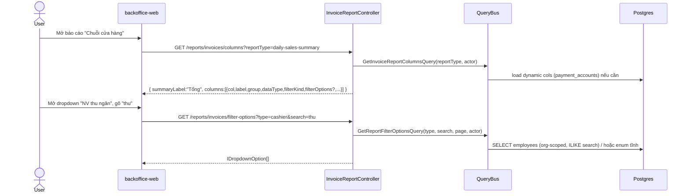
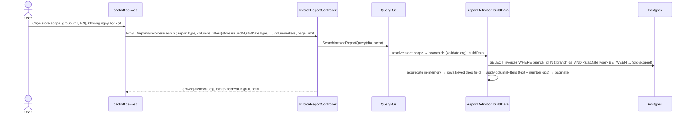
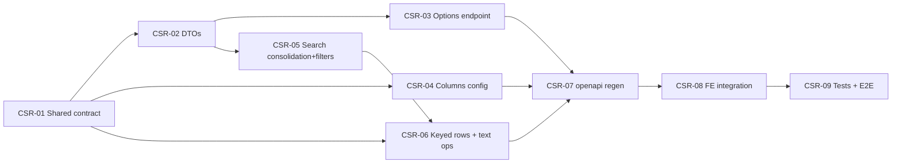

# EPIC-24062026 Chain-Store Report API (invoice-report)

## Goal

Đưa backend `invoice-report` bám đúng hợp đồng 3-API mà FE đã dựng cho chế độ **Chuỗi cửa hàng**
(tài liệu "Báo cáo — Thông tin truyền cho Backend"), cho 4 báo cáo bán hàng:
`daily-sales-summary`, `invoice-order-listing`, `invoice-item-revenue-detail`, `revenue-by-item`.

Hiện trạng đã đối chiếu trong code (không phải greenfield):

- **(1) Cấu hình bảng** — `GET /reports/invoices/columns?reportType=` đã có, nhưng header chỉ trả
  `{col, name, desc, type, group}`. Thiếu `filterKind`, `filterOptions` (cột `select` như `status`),
  `summaryLabel` và thuộc tính hiển thị (`align/pinned/link/width`). FE đang tự suy ra từ registry.
- **(2) Dữ liệu** — `POST /reports/invoices/search` đã có, nhưng response là **mảng cell**
  (`dataRaw: ReportCell[][]`) thay vì **rows keyed theo field** như FE yêu cầu; bộ `reportFilters` còn
  mỏng (thiếu `store` scope đa chi nhánh, `invoiceStatus` multi, `statDateType`, `productType`, `statBy`,
  `statisticByBrand`, `allocateComboRevenue`); `columnFilters` chỉ có `eq/lt/lte/gt/gte/from/to` (thiếu
  toán tử text `contains/startsWith/endsWith/notContains`).
- **(3) Options dropdown (dùng chung)** — **chưa có endpoint nào.** FE đang mock toàn bộ dropdown filter
  (status, statDateType, cashier, salesperson, customer, productGroup, brand, unit…); chỉ store-single
  dùng API thật `useMyBranches`.

Outcome đo được: 4 báo cáo bán hàng chạy hoàn toàn bằng API thật ở chế độ Chuỗi cửa hàng — không còn
mock dropdown, response đúng shape FE, lọc đa chi nhánh (consolidation) hoạt động.

## Scope

- **Entities/tables:** KHÔNG có migration. Tất cả thay đổi là contract types + query/aggregation logic
  + 1 endpoint read mới. Đọc dữ liệu từ entity sẵn có (invoices, invoice_items, invoice_payments,
  branches, customers, employee_profiles, item_categories, items, payment_accounts).
- **API surface (custom, CQRS — không phải generic CRUD):**
  - Reshape contract trong `@erp/shared-interfaces/src/invoice-report/*`.
  - Mới: `GET /reports/invoices/filter-options?type=&search=&page=&pageSize=` → `IDropdownOption[]`.
  - Sửa: `GET /reports/invoices/columns` (header giàu hơn + `summaryLabel`).
  - Sửa: `POST /reports/invoices/search` (filters mở rộng, consolidation, rows keyed, text operators).
- **Events:** không. Chỉ đọc.
- **FE surface:** `apps/backoffice-web/src/pages/chain-store/reports/_api/*` + `report.interface.ts`;
  thay mock dropdown bằng hook gọi options API; gửi đủ filter; xóa `_mock/report-daily-sales.*` (dead code).
- **Scope = 4 báo cáo bán hàng.** 8 báo cáo Kho (B.5–B.12) đã có API thật riêng (`api/inventory-reports`)
  — KHÔNG đụng tới trong epic này.

## Out of scope (chốt rõ)

- **Cột placeholder không có nguồn dữ liệu** vẫn trả `0`/`null`, không được "đắp" số liệu trong epic này:
  `revenue.fee`, `payment.collectOnBehalf`, `payment.bankAccount`, `salesChannel`, mọi `platform.*`,
  `reference`, `receiver`, `receiverPhone`. Lý do: hệ thống chưa có sàn TMĐT / kênh bán / số tham chiếu.
  Chúng vẫn xuất hiện trong catalog (đúng doc) nhưng giá trị rỗng — ghi chú rõ cho FE.
- Báo cáo Kho B.5–B.12 (đã có surface riêng).
- Lưu/chia sẻ template nâng cao (CRUD template hiện có giữ nguyên, chỉ sửa view theo shape mới nếu cần).

## Success Metrics

- FE Chuỗi cửa hàng: cả 4 báo cáo lấy **config + data + options** từ API thật, 0 mock dropdown.
- `POST /search` với `store.scope="group", storeIds=[A,B]` trả số liệu **gộp đúng** nhiều chi nhánh
  (tổng = tổng từng chi nhánh), validate `storeIds` thuộc org của actor.
- `GET /columns` trả `summaryLabel:"Tổng"` + mỗi cột có `dataType/filterKind`; cột `status` kèm
  `filterOptions` đúng enum.
- `GET /filter-options?type=cashier&search=thu` trả `IDropdownOption[]` lọc theo search, phân trang.
- `pnpm --filter @erp/api test` xanh; openapi snapshot + api-client cập nhật & commit.

## Flows

### Cấu hình bảng + Options (mở dialog filter)

### Lấy dữ liệu (consolidation đa chi nhánh)

## Tickets

- [TKT-CSR-01 Shared contract reshape (types + enums)](../tickets/TKT-CSR-01-shared-contract-reshape.md)
- [TKT-CSR-02 DTOs: filter / column-filter / options query](../tickets/TKT-CSR-02-dtos-filter-options.md)
- [TKT-CSR-03 Dropdown filter-options endpoint](../tickets/TKT-CSR-03-filter-options-endpoint.md)
- [TKT-CSR-04 Enrich columns API (table config)](../tickets/TKT-CSR-04-columns-table-config.md)
- [TKT-CSR-05 Search: store-scope consolidation + new filters](../tickets/TKT-CSR-05-search-consolidation-filters.md)
- [TKT-CSR-06 Keyed-row response + text column operators](../tickets/TKT-CSR-06-keyed-rows-text-operators.md)
- [TKT-CSR-07 openapi:generate + api-client snapshot](../tickets/TKT-CSR-07-openapi-regen.md)
- [TKT-CSR-08 FE integration (real options + filters + mapper)](../tickets/TKT-CSR-08-fe-integration.md)
- [TKT-CSR-09 Tests + E2E + DoD gate](../tickets/TKT-CSR-09-tests-e2e.md)

## Dependencies

- Depends on: existing `invoice-report` module (4 report definitions, CQRS controller, templates),
  POS `InvoiceEntity`/`InvoiceItemEntity`/`InvoicePaymentEntity`, `BranchEntity`, `CustomerEntity`,
  `EmployeeProfileEntity`, `ItemCategoryEntity`, `ItemEntity`, `PaymentAccountEntity`.
- Reuses: `@erp/shared-interfaces/invoice-report/*`, `common/filters/filter.dto.ts`
  (`DateRangeFilterDto`, `EnumFilterDto`), `FilterBuilder`, existing RBAC permissions
  (`reporting.invoice.branch.read`, `reporting.invoice.consolidated.read`).

### Ticket dependency graph

