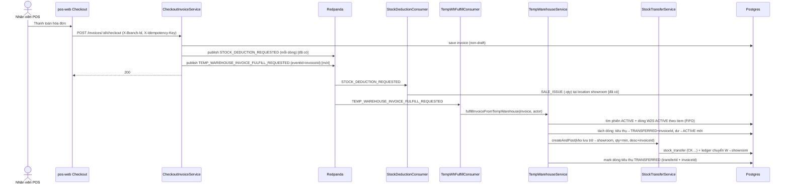
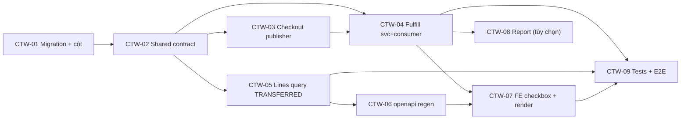

# EPIC-25062026 Checkout ↔ Kho tạm — auto-chuyển kho khi bán + lọc dòng đã chuyển

## Goal

Khi **bán hàng (checkout)**, với mỗi mặt hàng đang có trong **kho tạm** (dòng `warehouse_to_showroom` còn ACTIVE của phiên hiện tại), hệ thống tự **chuyển kho từ kho lưu trữ sang showroom** đúng số lượng `min(số lượng bán, số lượng kho tạm)`, gắn với hóa đơn, rồi trừ tồn showroom như hiện tại. Trên trang **Chuyển kho tạm** (pos-web), dòng đã được sale tiêu thụ (đã chuyển ra showroom) sẽ **biến mất khi tích "Hiển thị dòng cần kiểm tra"** và **hiện lại khi bỏ tích**.

Measurable outcome: checkout 1 hóa đơn có item nằm trong kho tạm → sinh đúng 1 phiếu Chuyển kho (CK…) `kho lưu trữ → showroom` với số lượng = `min(saleQty, tempQty)`, mô tả `"Chuyển kho bán hàng hóa từ phiếu xuất đi tại kho tạm theo hóa đơn số <invoiceNumber>"`, dòng kho tạm tiêu thụ chuyển ACTIVE → TRANSFERRED và mang `invoiceId`; phần dư (tempQty − saleQty) còn lại 1 dòng ACTIVE. Trang Chuyển kho tạm ẩn/hiện dòng TRANSFERRED-by-sale đúng theo checkbox.

## Decisions (locked)

- **Async, tái dùng pipeline sự kiện.** Checkout publish thêm 1 sự kiện fulfill (eventId tất định = `invoiceId`); một consumer mới khớp dòng kho tạm + tách dòng + gọi `StockTransferService.createAndPost`. SALE_ISSUE showroom vẫn đi qua `STOCK_DEDUCTION_REQUESTED` như cũ. Tồn showroom âm tạm thời được chấp nhận (đúng kiến trúc hiện tại), cuối cùng cân bằng.
- **Tách dòng theo số lượng bán.** `consumeQty = min(saleQty, tổng tempQty ACTIVE của item)`, khớp dòng **FIFO theo `createdAt`**. Dòng tiêu thụ một phần: phần tiêu thụ → TRANSFERRED (gắn `invoiceId`), phần dư → 1 dòng ACTIVE mới (theo pattern `supersededById` sẵn có).
- **Liên kết hóa đơn có cấu trúc.** Thêm cột `invoice_id` (+ `invoice_number`) lên `temp_warehouse_lines` và `stock_transfers` (migration nhỏ). Cho phép report kho tạm điền được `saleQty`/`invoice` (hiện luôn 0/'').
- **Checkbox "Hiển thị dòng cần kiểm tra":** TÍCH → chỉ dòng cần xử lý (ACTIVE, chưa cân bằng/chưa chuyển); BỎ TÍCH → kèm dòng TRANSFERRED-by-sale (read-only, cột "Chuyển kho" đánh dấu). Backend `GET .../lines` thêm khả năng trả dòng TRANSFERRED (kèm field hóa đơn).

## Scope

- **Entities/tables (extend, không tạo bảng mới):** `temp_warehouse_lines` + `stock_transfers` thêm cột `invoice_id`/`invoice_number`. Scope `ORGANIZATION + BRANCH` (theo phiên kho tạm per-branch). 1 migration hand-written.
- **API:** publisher mới trong `CheckoutInvoiceService`; consumer + service method mới trong `modules/inventory/temp-warehouse`; mở rộng `GET /inventory/temp-warehouse/lines` để trả dòng TRANSFERRED-by-sale. Tái dùng `TempWarehouseTransferMaterializerService` + `StockTransferService.createAndPost`.
- **Events:** thêm `TEMP_WAREHOUSE_INVOICE_FULFILL_REQUESTED` (publish ở checkout, consume ở temp-warehouse). Idempotent: eventId tất định = `invoiceId` + `processed_events`.
- **FE:** `pos-web` `FastStockTransfer` (trang Chuyển kho tạm) — đổi ngữ nghĩa checkbox + render dòng TRANSFERRED-by-sale. Tùy chọn: report kho tạm (backoffice) điền `saleQty`/`invoice`.
- UI strings Vietnamese; mọi identifier/column/enum/log/swagger backend English.

## Success Metrics

- Checkout item có trong kho tạm → đúng 1 phiếu CK `kho lưu trữ → showroom`, qty = `min(saleQty, tempQty)`, mô tả gắn `invoiceNumber`, transfer mang `invoiceId`.
- Dòng kho tạm tiêu thụ: ACTIVE → TRANSFERRED + `invoiceId` + `transferId`; phần dư còn 1 dòng ACTIVE đúng `tempQty − saleQty`.
- Không có phiên kho tạm ACTIVE, hoặc item không nằm trong kho tạm → checkout hành xử như hiện tại (chỉ SALE_ISSUE showroom).
- Replay sự kiện (cùng `invoiceId`) không sinh phiếu CK / tách dòng lần hai.
- Trang Chuyển kho tạm: tích checkbox → ẩn dòng đã sale; bỏ tích → hiện lại (cột "Chuyển kho" đánh dấu).
- Migration giữ nguyên dữ liệu cũ (`invoice_id` nullable, backfill = NULL).

## Flows

## Tickets

- [TKT-CTW-01 BE: migration + cột liên kết hóa đơn (temp_warehouse_lines + stock_transfers)](../tickets/TKT-CTW-01-schema-invoice-link.md)
- [TKT-CTW-02 Shared-interfaces: event fulfill + field hóa đơn + filter status dòng](../tickets/TKT-CTW-02-shared-contract.md)
- [TKT-CTW-03 BE: checkout publish sự kiện fulfill](../tickets/TKT-CTW-03-checkout-publisher.md)
- [TKT-CTW-04 BE: fulfillment service + consumer (khớp + tách FIFO + transfer, idempotent)](../tickets/TKT-CTW-04-fulfillment-service-consumer.md)
- [TKT-CTW-05 BE: lines query trả dòng TRANSFERRED-by-sale + field hóa đơn](../tickets/TKT-CTW-05-lines-query-transferred.md)
- [TKT-CTW-06 openapi:generate + commit api-client snapshot](../tickets/TKT-CTW-06-openapi-regen.md)
- [TKT-CTW-07 FE: pos-web FastStockTransfer — ngữ nghĩa checkbox + render dòng TRANSFERRED](../tickets/TKT-CTW-07-fe-checkbox-transferred.md)
- [TKT-CTW-08 (tùy chọn) Report kho tạm: điền saleQty/invoice từ liên kết hóa đơn](../tickets/TKT-CTW-08-report-saleqty-invoice.md)
- [TKT-CTW-09 E2E + test plan + DoD gate](../tickets/TKT-CTW-09-tests-e2e.md)

## Dependencies

- Depends on: `CheckoutInvoiceService` + `StockDeductionPublisher`/consumer (POS checkout), temp-warehouse subsystem (`TempWarehouseService`, `temp_warehouse_sessions`/`_lines`, `TempWarehouseTransferConsumer`, `TempWarehouseTransferMaterializerService`), `StockTransferService.createAndPost`, pos-web `FastStockTransfer`.
- Reuses: pipeline sự kiện Kafka + `processed_events` (idempotency), pattern tách dòng `supersededById`, materializer giải shelf nguồn/đích, `@erp/shared-interfaces` temp-warehouse types, axios `http` + types ở pos-web (không qua api-client generated).

### Ticket dependency graph

## Out of scope

- Item KHÔNG nằm trong kho tạm hoặc không có phiên ACTIVE → giữ nguyên flow checkout hiện tại (không đổi).
- Thay đổi logic posting/ledger của stock-transfer hay của SALE_ISSUE.
- Luồng "Trả lại" (showroom_to_warehouse) khi hủy/đổi/trả hàng — epic này chỉ xử lý chiều bán.
- Ngữ nghĩa "balanced pair" hiện có của checkbox giữ nguyên cho tập ACTIVE; chỉ bổ sung tập TRANSFERRED-by-sale khi bỏ tích.
- Đồng bộ ngược khi hủy hóa đơn đã checkout (reverse transfer) — cân nhắc epic sau.
