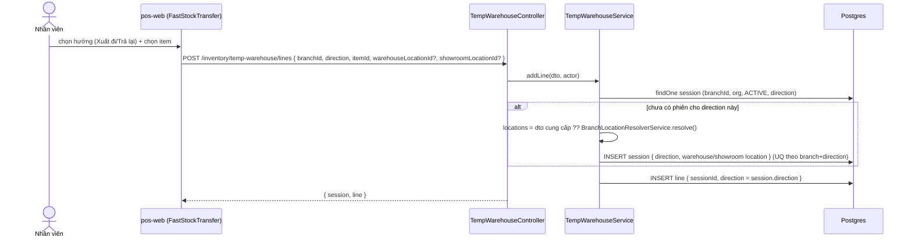
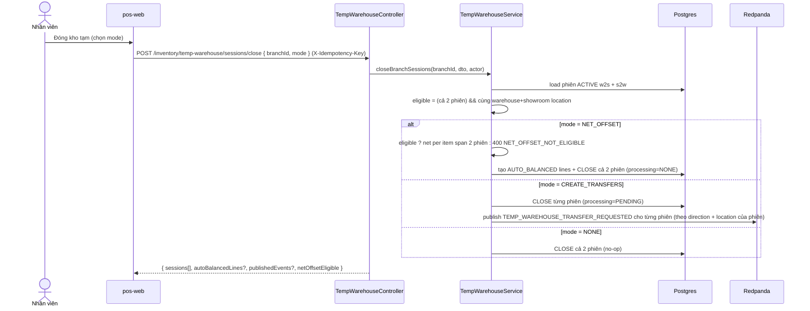
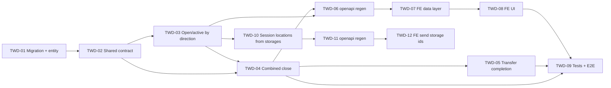

# EPIC-25062026 Kho tạm theo hướng phiên (session-level direction w2s/s2w + combined close)

## Goal

Tách **hướng (direction)** từ cấp dòng lên **cấp phiên** kho tạm: một chi nhánh có thể mở **tối đa 2 phiên ACTIVE** cùng lúc — `w2s` (warehouse→showroom, "Xuất đi") và `s2w` (showroom→warehouse, "Trả lại"). Mỗi phiên có thể chọn `warehouse_location`/`showroom_location` **riêng** (client cung cấp  ). Việc đóng phiên chuyển sang **đóng gộp theo chi nhánh**: chỉ chạy "đối cộng trừ" (`NET_OFFSET`) khi **cả 2 phiên cùng tồn tại và cùng cặp location**; ngược lại (khác location, hoặc chỉ 1 phiên) thì **không đối cộng trừ — chuyển thẳng single** (`CREATE_TRANSFERS` từng phiên).

**Outcome đo được:**

- `GET /inventory/temp-warehouse/sessions/active?branchId=X&direction=w2s|s2w` trả đúng phiên theo hướng (404 `TEMP_WAREHOUSE_NO_ACTIVE_SESSION` nếu chưa có).
- Thêm 1 dòng `w2s` và 1 dòng `s2w` cho cùng chi nhánh tạo **2 phiên ACTIVE độc lập**, không vi phạm unique index.
- Đóng gộp: 2 phiên **cùng location** + `NET_OFFSET` → kết quả như flow cũ; 2 phiên **khác location** hoặc **1 phiên** → từng phiên tạo phiếu chuyển single, `NET_OFFSET` bị từ chối (400).

## Scope

- **Entities (extend):** `temp_warehouse_sessions` thêm cột `direction varchar(30) NULL`. Đổi partial unique index `UQ_temp_wh_one_active_per_branch` → unique theo `(branch_id, direction)` khi `status='ACTIVE'`. `warehouse_location_id`/`showroom_location_id` (đã có, NOT NULL) giờ có thể do client cung cấp lúc mở phiên. Multi-tenant: org + branch (như cũ).
- **API surface (custom, không phải generic CRUD):**
  - `GET sessions/active` thêm query `direction` (bắt buộc).
  - `POST lines` (addLine): `direction` thành **bắt buộc**; thêm optional `warehouseLocationId`/`showroomLocationId`.
  - **Thay** `POST sessions/:id/close` bằng `POST sessions/close` (đóng gộp theo `{ branchId, mode }`).
  - `listLines`/netted view phải phân giải phiên theo `direction`, và netted-gộp span cả 2 phiên ACTIVE của chi nhánh.
- **Events:** tái dùng `ERP_TOPICS.TEMP_WAREHOUSE_TRANSFER_REQUESTED` (eventId tất định `uuidv5(sessionId:direction)`); consumer/materializer cập nhật để **phiên single-direction hoàn tất sau đúng 1 transfer**.
- **FE:** `apps/pos-web` trang Chuyển kho tạm (`FastStockTransferPage`) — data layer (service/hook/key) + UI (wiring 2 phiên, gate `NET_OFFSET` theo eligibility, picker location feed vào addLine).

## Success Metrics

- Migration cộng cột + đổi index, **không phá** dữ liệu hợp lệ hiện có (legacy `direction=NULL` không xung đột; nhánh in-flight chưa có dữ liệu prod).
- Mọi query lọc theo `actor.organizationId` (+ `branchId`/`direction` khi cần); không rò chéo tenant.
- Đóng gộp idempotent (replay cùng mode → trạng thái hiện tại; khác mode → 409).
- Unit + e2e phủ: happy (2 phiên cùng loc + NET_OFFSET), case-2 (2 phiên khác loc → single), case-3 (1 phiên → single), từ chối NET_OFFSET khi không eligible.

## Flows

### Mở phiên theo hướng (addLine auto-open per direction)

### Đóng gộp theo chi nhánh (combined close + eligibility)

## Tickets

- [TKT-TWD-01 Migration + entity: session.direction + unique (branch,direction)](../tickets/TKT-TWD-01-schema-session-direction.md)
- [TKT-TWD-02 Shared-interfaces: session direction + DTO bodies](../tickets/TKT-TWD-02-shared-contract.md)
- [TKT-TWD-03 DTO + service: open per direction + active/list theo direction](../tickets/TKT-TWD-03-open-active-by-direction.md)
- [TKT-TWD-04 Combined close + net-offset eligibility (service + controller)](../tickets/TKT-TWD-04-combined-close.md)
- [TKT-TWD-05 Consumer/materializer: phiên single-direction hoàn tất sau 1 transfer](../tickets/TKT-TWD-05-transfer-completion.md)
- [TKT-TWD-06 openapi:generate + api-client snapshot](../tickets/TKT-TWD-06-openapi-regen.md)
- [TKT-TWD-07 FE data layer (service + hooks + query keys)](../tickets/TKT-TWD-07-fe-data-layer.md)
- [TKT-TWD-08 FE UI: wiring 2 phiên + gate NET_OFFSET + picker location](../tickets/TKT-TWD-08-fe-ui.md)
- [TKT-TWD-09 Tests + E2E + DoD gate](../tickets/TKT-TWD-09-tests-e2e.md)

### Follow-up: session locations từ kho đã chọn (sửa lỗi location trùng)

`addLine` chưa truyền kho → BE rơi về resolver → `warehouse_location_id == showroom_location_id`. Cho addLine nhận **storage id** từ picker, BE resolve → location mặc định, và **chặn trùng** (400 khi 2 location bằng nhau).

- [TKT-TWD-10 addLine: session locations từ kho đã chọn (storage→location) + chặn trùng](../tickets/TKT-TWD-10-session-locations-from-storages.md)
- [TKT-TWD-11 openapi:generate (addLine storage ids) + snapshot](../tickets/TKT-TWD-11-openapi-regen-storages.md)
- [TKT-TWD-12 FE: truyền kho đã chọn (storage ids) xuống addLine](../tickets/TKT-TWD-12-fe-send-storage-ids.md)

## Dependencies

- Depends on: `modules/inventory/temp-warehouse` (EPIC kho tạm gốc), `EPIC-25062026 Checkout ↔ Kho tạm` (cột `invoice_id` đã có trên lines — không đụng).
- Reuses: `BranchLocationResolverService`, `TempWarehouseTransferMaterializerService`, `buildEventPayload`/`buildAutoBalancedLines`, `EventPublisher`, global `IdempotencyInterceptor`, enum `TempWarehouseDirection`/`TempWarehouseCloseMode` (không thêm enum mới), pos-web `tempWarehouseService` (axios `http`).

### Ticket dependency graph

