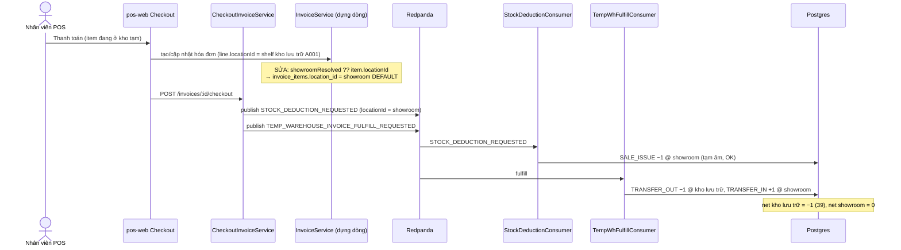
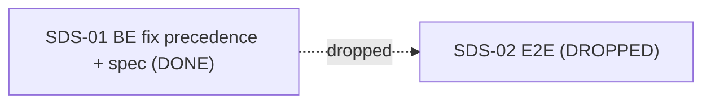

# EPIC-27062026 POS bán hàng — SALE_ISSUE phải trừ tại showroom (sửa double-trừ kho lưu trữ khi auto-chuyển kho tạm)

## Goal

Khi **checkout** một item đang nằm trong **kho tạm** (dòng `warehouse_to_showroom` ACTIVE), hệ thống auto sinh phiếu chuyển `kho lưu trữ → showroom` (EPIC-25062026). Nhưng `SALE_ISSUE` của hóa đơn lại trừ tồn **tại chính kho lưu trữ** thay vì showroom, nên kho lưu trữ bị trừ **hai lần** (SALE_ISSUE + TRANSFER_OUT) và showroom dư ra.

Sửa để **mọi hóa đơn bán POS luôn trừ tồn tại showroom** (đúng ý định đã ghi ở `invoice.service.ts:410` *"POS sales always deduct from the showroom"*). Nguyên nhân: dòng hóa đơn lấy `item.locationId ?? showroomResolved` — `item.locationId` do FE gửi (shelf kho lưu trữ, ví dụ `A001`) **thắng** kết quả giải showroom. Đảo thứ tự: showroom thắng, location FE chỉ là fallback khi item không có shelf showroom.

Measurable outcome: bán 1 đôi `GELLI-39-NAU` đang ở kho tạm (Warehouse A 40 → showroom 0) → kết sổ **Warehouse A = 39, showroom = 0** (thay vì 38 / 1). `SALE_ISSUE` ghi tại `location` showroom (`is_main_storage = true`), không ghi tại kho lưu trữ.

## Decisions (locked)

- **Phạm vi: mọi hóa đơn bán POS** (không chỉ dòng kho tạm). Tại lúc dựng dòng hóa đơn bán, kết quả giải showroom (`resolveItemLocations`, `showroomOnly: true`) **thắng** `item.locationId` do FE gửi. Chỉ fallback về `item.locationId` khi item chưa có shelf showroom nào.
- **Chỉ sửa luồng bán.** Đụng 2 điểm trong `invoice.service.ts`: tạo hóa đơn (`:178`) và cập nhật draft (`:335`). **Không** đụng `create-exchange-invoice.service.ts:170` (đổi/trả OUT cố ý không `showroomOnly`).
- **Fix-forward, không migration.** Không sửa ledger đã sai của hóa đơn cũ; user tự điều chỉnh tồn thủ công. Không đổi logic posting của stock-transfer hay của `STOCK_DEDUCTION_REQUESTED`/consumer.
- **Không đổi contract API/event.** Không cần `openapi:generate`, không đụng shared-interfaces, không đụng FE.

## Scope

- **API (sửa, không thêm bảng/endpoint):** đảo thứ tự resolve `locationId` cho dòng hóa đơn bán trong `apps/api/src/modules/pos/services/invoice.service.ts` (create + update draft).
- **Events:** không đổi. `SALE_ISSUE` vẫn đi qua `STOCK_DEDUCTION_REQUESTED`; chỉ `locationId` trong payload đổi từ kho lưu trữ → showroom (vì đọc từ `invoice_items.location_id`).
- **FE:** không đổi (POS vẫn được gửi `locationId`; backend bỏ qua khi là kho lưu trữ).
- Mọi identifier/column/enum/log/swagger backend English.

## Success Metrics

- Bán item có trong kho tạm: `SALE_ISSUE −qty` ghi tại `location` showroom; net kho lưu trữ chỉ bị `TRANSFER_OUT −qty`; net showroom = `TRANSFER_IN +qty` + `SALE_ISSUE −qty` = 0.
- Bán item KHÔNG trong kho tạm nhưng item có shelf showroom: `SALE_ISSUE` vẫn ghi tại showroom (như ý định cũ) — không đổi hành vi đúng đã có.
- Item không có shelf showroom nào: fallback về `item.locationId` (giữ nguyên hành vi cũ, không null `locationId`).
- Không đổi luồng đổi/trả (exchange OUT) và không đổi posting ledger/transfer.

## Flows

## Tickets

- [TKT-SDS-01 BE: dòng hóa đơn bán resolve location về showroom (đảo precedence) + unit spec](../tickets/TKT-SDS-01-sale-deduct-showroom-location.md) — **DONE** (2 điểm sửa + 3 unit test xanh).
- [TKT-SDS-02 E2E ...](../tickets/TKT-SDS-02-e2e-ledger-balance.md) — **DROPPED**: unit coverage ở SDS-01 đủ; fulfillment e2e không sinh `SALE_ISSUE`, e2e checkout async đầy đủ quá nặng/flaky cho fix 1 dòng. Epic đóng sau SDS-01.

## Dependencies

- Depends on: EPIC-25062026 (Checkout ↔ Kho tạm auto-chuyển kho), `InvoiceService`/`CheckoutInvoiceService`, `resolveBranchItemLocations` (`showroomOnly`), `StockDeductionConsumer` (đọc `invoice_items.location_id`).
- Reuses: `resolveItemLocations` sẵn có (chỉ đảo thứ tự ưu tiên), `temp-warehouse-fulfillment.e2e-spec.ts` (mở rộng assertion).

### Ticket dependency graph

## Out of scope

- Sửa/đảo ledger đã sai của hóa đơn đã checkout (fix-forward; user tự điều chỉnh).
- Đổi logic posting của stock-transfer hoặc của `STOCK_DEDUCTION_REQUESTED`/consumer.
- Luồng đổi/trả (exchange/return OUT) — cố ý không `showroomOnly`, giữ nguyên.
- Thay đổi FE pos-web (vẫn gửi `locationId`; backend tự bỏ qua khi là kho lưu trữ).
- Reverse auto-transfer khi hủy hóa đơn — epic khác.
