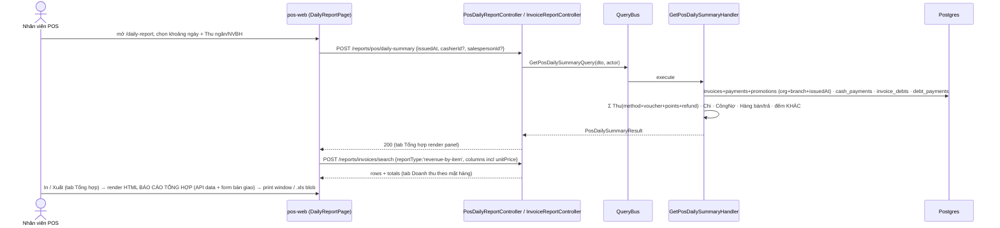
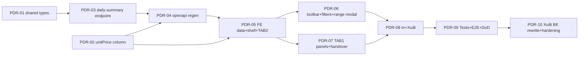

# EPIC-27072026 Báo cáo theo ngày (POS Daily Report — pos-web, 2 tab + endpoint tổng hợp)

## Goal

Dựng trang **"Báo cáo theo ngày"** trong **pos-web** (menu item `bao-cao-theo-ngay` đã có nhưng chưa có route/page), mô phỏng báo cáo cuối ngày kiểu KiotViet/MISA. Trang gồm **2 tab**:

- **Tổng hợp** — panel TỔNG (Thu/Chi/Công nợ), HÀNG BÁN, HÀNG TRẢ, KHÁC, và BÀN GIAO TIỀN (form nhập tay).
- **Doanh thu theo mặt hàng** — bảng doanh thu theo mặt hàng (tái dùng report `revenue-by-item` có sẵn), thêm cột **Đơn giá**.

Kèm bộ lọc thời gian (preset + "Khác" custom range), lọc **Thu ngân** + **NVBH** (áp cho cả 2 tab), và **In + Xuất** tài liệu "BÁO CÁO TỔNG HỢP" (chỉ tab Tổng hợp). **In** render client-side (A80 print window); **Xuất** sinh file `.xlsx` **server-side** (`exceljs`, đổi từ client-side HTML-table `.xls` sau PDR-10 để khớp chính xác cấu trúc file mẫu).

## Scope

- **BE — endpoint mới** `POST /reports/pos/daily-summary` (module con `reporting/pos-daily-report/`, CQRS query+handler) trả 1 object tổng hợp: Thu (Tiền mặt/Thẻ/ATM/Chuyển khoản/Voucher/Điểm), Chi (Tiền mặt/Chuyển khoản), Công nợ (Ghi nợ/Giảm nợ), Hàng bán/Hàng trả (SL+giá trị), KHÁC (đếm hóa đơn theo type + voucher/mã ưu đãi/biên lai thẻ). Gộp toàn cửa sổ, **KHÔNG** chia theo ngày như `daily-sales-summary`.
- **BE — thêm cột `unitPrice`** (Đơn giá) vào report `revenue-by-item` (bình quân gia quyền `goods/quantity`; dòng tổng null). Additive, không đổi controller/DTO.
- **BE — không entity/migration mới.** Tái dùng `report-query.util.ts` (scope org+branch, status filter, sign returns), `daily-sales-summary` (logic Thu/voucher/points/refund-net), `cash_payments` (Chi), `invoice_debts`/`debt_payments` (Công nợ).
- **shared-interfaces (additive):** type `PosDailySummaryResult` (+ sub-shapes) cho FE tiêu thụ qua api-client.
- **FE — pos-web:** page + page-hook + service + react-query hook + dtos/interfaces/constants + page-components (2 tab, các panel, bảng, 2 modal "Chi tiết kiểm đếm" & "Chọn thời gian"), route `/daily-report`, menu route, wire preset "OTHER" (custom range) trong `dateRangeFilter.ts`.
- **FE — BÀN GIAO TIỀN + kiểm đếm = FE-only** (nhập tay + in, không lưu DB).
- **In/Xuất, CHỈ tab Tổng hợp:** In = client-side print window (renderer HTML, số liệu API + field bàn giao nhập tay). Xuất = **BE-generated `.xlsx`** (`POST /reports/pos/daily-summary/export`, module `pos-daily-report`, `exceljs`) — nhận thêm snapshot form BÀN GIAO TIỀN từ FE (không nguồn nào khác vì không persist DB); xem PDR-10. TAB 2 In/Xuất **tạm hoãn**.

## Success Metrics

- `POST /reports/pos/daily-summary` trả đủ 5 nhóm số liệu, scope đúng `organizationId` + `branchId`, lọc theo `issuedAt` from–to + `cashierId`/`salespersonId`; đối chiếu khớp SQL thủ công trên data seed.
- `GET /reports/invoices/columns?reportType=revenue-by-item` liệt kê `unitPrice`; `POST search` trả `unitPrice ≈ Tiền hàng/SL bán`, dòng tổng `unitPrice = null`.
- Trang `/daily-report` render 2 tab; đổi preset/custom-range/Thu ngân/NVBH refetch đúng cả 2 tab; BÀN GIAO TIỀN là state client thuần (không network write).
- Ở tab Tổng hợp: In mở print window đúng layout; Xuất tải `.xlsx` (server-side) mở được bằng Excel, khớp file mẫu `Báo cáo tổng hợp (3).xls` (verify bằng đọc lại buffer qua `exceljs`, không chỉ trust response 200).
- No-regress: 4 report type cũ (`daily-sales-summary`/`invoice-order-listing`/`invoice-item-revenue-detail`/`revenue-by-item`) không đổi hành vi. `pnpm --filter @erp/api test` + `lint` xanh; `openapi:generate` chạy, snapshot + `schema.ts` committed.

## Decisions (chốt với user)

- **Phạm vi:** FE + BE đầy đủ, dữ liệu thật.
- **Thu breakdown:** Tiền mặt / Thẻ / (ATM) / Chuyển khoản / Voucher / Điểm; Voucher & Điểm là payment-equivalent (tái dùng `payment.voucher`/`payment.points` của `daily-sales-summary`). ATM: verify enum payment method — có type riêng thì tách, không thì bỏ dòng.
- **Chi:** từ `cash_payments` POSTED trong cửa sổ (`voucherDate`), chia Tiền mặt/Chuyển khoản theo `cashAccountId`. **Phiếu refund** có thể vừa Thu (+) vừa Chi (−), chia rõ tiền mặt/CK; Chi **vẫn gồm** phần âm của refund. Cần đọc kỹ cơ chế phiếu refund để đối chiếu.
- **Công nợ:** Ghi nợ (`invoice_debts` credit) + Giảm nợ (`debt_payments`).
- **Custom range "Khác":** from–to đầy đủ (2 mốc datetime) qua modal "Chọn thời gian".
- **KHÁC counts:** hiển thị đủ layout; chỉ số chưa rõ định nghĩa (SL Biên lai thẻ, SL Mã ưu đãi) tạm trả 0 (comment TODO).
- **Route path tiếng Anh** `/daily-report`.
- **In/Xuất chỉ tab Tổng hợp.** In client-side (A80 print window). Xuất ban đầu client-side `.xls` HTML-table zero-dep (PDR-08) → **đổi sang BE-generated `.xlsx`** qua `exceljs` ở PDR-10 để khớp chính xác merge/border/font file mẫu (HTML-table blob không kiểm soát được các chi tiết này).
- **pos-web chưa có filter "Cửa hàng"** — nên `daily-summary`/`export` mặc định scope theo `actor.branchId` (chi nhánh đang active) kể cả với user có quyền `reporting.invoice.consolidated.read`, thay vì để trống = "tất cả chi nhánh" như các report backoffice khác (PDR-10).

## Out of scope

- Lưu BÀN GIAO TIỀN / kiểm đếm vào DB (FE-only).
- In/Xuất tab "Doanh thu theo mặt hàng" (tạm hoãn).
- Realtime (Socket.IO) cập nhật khi có hóa đơn mới (dùng refetch thủ công/`placeholderData`).
- Định nghĩa chính xác SL Biên lai thẻ / SL Mã ưu đãi (chờ chốt; tạm 0).

## Flows

## Tickets

- [TKT-PDR-01 shared-interfaces: PosDailySummaryResult types](../tickets/TKT-PDR-01-shared-interfaces-daily-summary.md)
- [TKT-PDR-02 BE: unitPrice column cho revenue-by-item (+ specs)](../tickets/TKT-PDR-02-revenue-by-item-unit-price.md)
- [TKT-PDR-03 BE: endpoint POST /reports/pos/daily-summary](../tickets/TKT-PDR-03-daily-summary-endpoint.md)
- [TKT-PDR-04 BE: openapi:generate + commit snapshot](../tickets/TKT-PDR-04-openapi-regen.md)
- [TKT-PDR-05 FE: data layer + page shell + route/menu + TAB 2 table](../tickets/TKT-PDR-05-fe-data-layer-shell-tab2.md)
- [TKT-PDR-06 FE: toolbar + filter Thu ngân/NVBH + custom-range modal](../tickets/TKT-PDR-06-fe-toolbar-filters-custom-range.md)
- [TKT-PDR-07 FE: TAB 1 panels + BÀN GIAO + kiểm đếm modal](../tickets/TKT-PDR-07-fe-summary-panels-handover.md)
- [TKT-PDR-08 FE: In + Xuất client-side (BÁO CÁO TỔNG HỢP, Tổng hợp only)](../tickets/TKT-PDR-08-fe-print-export.md)
- [TKT-PDR-09 Tests + E2E + verify + DoD](../tickets/TKT-PDR-09-tests-e2e-dod.md)
- [TKT-PDR-10 Xuất → BE-generated .xlsx + post-launch hardening](../tickets/TKT-PDR-10-export-be-rewrite-hardening.md)

## Dependencies

- **Depends on:** [EPIC-11062026 invoice-report-builder](./EPIC-11062026-invoice-report-builder.md) (`InvoiceReportController`/registry/`report-query.util`), [EPIC-15062026 revenue-by-item](./EPIC-15062026-revenue-by-item-report.md) (report được mở rộng cột), [EPIC-18052026 Phiếu Thu/Phiếu Chi](./EPIC-18052026-cash-vouchers.md) (`cash_payments` cho Chi), [EPIC-15072026 debt-reports](./EPIC-15072026-debt-reports.md)/EPIC-011 (invoice_debts/debt_payments), [EPIC-16062026 active-branch-in-token] (actor.branchId từ JWT).
- **Reuses:** `report-query.util.ts` (`resolveBranchIds`/`applyBranchScope`/`applyInvoiceStatusFilter`/`invoiceTypeSign`/`signedGoods`), `daily-sales-summary.report.ts` + `invoice-report.aggregator.ts` (Thu/voucher/points/refund-net), `FilterBuilder.applyDateRange`, FE: `InvoiceListPage` slice pattern, `PosDateRangeFilter`/`dateRangeFilter.ts`, `PosDialog`, `PosPaginationBar`, `PosSelect`, `usePosBranchStore`, `BrowserWindowInvoicePrinter`.

### Ticket dependency graph

