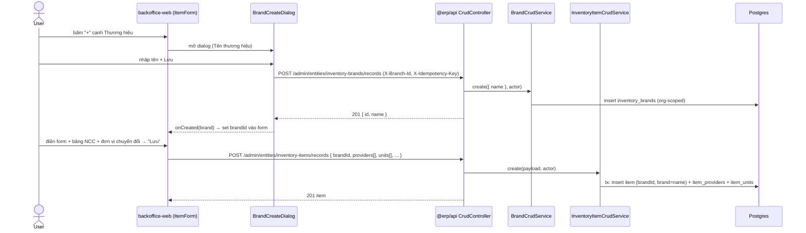
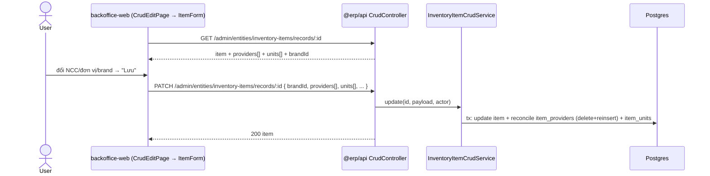
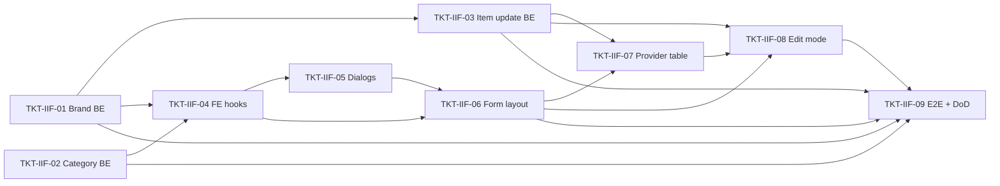

# EPIC-31052026 Inventory Item Form Refactor (KiotViet-style)

## Goal

Refactor màn hình tạo/sửa hàng hóa ở `backoffice-web` (`/admin/inventory-items/new` + `/admin/inventory-items/:id/edit`) cho khớp layout tham chiếu (KiotViet-style), với:

- Picker **Nhóm hàng hóa**, **Thương hiệu**, **Đơn vị tính** lấy dữ liệu từ API + quick-create dialog.
- Quản lý **nhiều nhà cung cấp** (multi-provider) cho 1 mặt hàng.
- Bảng **Đơn vị chuyển đổi** với ô chọn đơn vị từ API.
- Hỗ trợ đầy đủ **cả tạo lẫn sửa** (hiện edit đang rơi về generic grid).

**Measurable outcome:** tạo + sửa 1 mặt hàng (gồm brand, ≥2 NCC, ≥1 đơn vị chuyển đổi, nhóm hàng có nhóm cha + hoa hồng) lưu thành công và load lại đúng; UI khớp ảnh tham chiếu; không còn dữ liệu hardcode (`BRAND_SUGGESTIONS`, `GROUP_SUGGESTIONS`).

> ⚠️ Yêu cầu ban đầu là "FE only" nhưng các ảnh #3/#4/#5/#6 đòi master-data thật. Theo quyết định của user, epic này **mở rộng sang BE** ở mức tối thiểu: thêm entity Brand, mở rộng Item Category (nhóm cha + mô tả + hoa hồng), và cho phép update nested (providers/units/brand) trên item.

## Scope

- **Entities:**
  - **New** `BrandEntity` (`inventory_brands`, scope ORGANIZATION, soft-delete) — Thương hiệu là master-data thật thay cho free-text.
  - **New** `ItemCategoryCommissionEntity` (`inventory_item_category_commissions`) — bảng con hoa hồng theo nhóm hàng.
  - **Extend** `ItemCategoryEntity` — thêm `parentGroupId` (self-FK, "Thuộc nhóm") + `description` ("Mô tả").
  - **Extend** `ItemEntity` — thêm `brandId` (FK → `inventory_brands`), giữ cột `brand` (string) denormalized cho back-compat.
  - **Reuse (không đổi schema)** `UnitOfMeasureEntity` (`inventory-item-units`), `ProviderEntity` + `ItemProviderEntity`, `ItemUnitEntity`.
- **API surface:**
  - Brand qua **generic CRUD platform** (`EntityRegistryService.registerEntity`) → entityKey `inventory-brands`, không hand-build admin page.
  - Item Category nâng cấp service custom (override create/update) để lưu nested commission + parent + description — vẫn dưới entityKey `inventory-item-categories`.
  - Item create đã nhận `brand`/`providers[]`/`units[]` (qua `InventoryItemCrudService.create`); bổ sung `brandId` + cho phép **update** reconcile `providers[]`/`units[]`/`brandId`.
- **Events:** không. Thuần CRUD master-data + item; không phát/nhận Kafka, không đụng stock ledger / journal. (Tồn kho ban đầu vẫn đi qua đường `initialStock` hiện có của item create — không thay đổi.)
- **FE surface:** `backoffice-web` — refactor `InventoryItemCreateForm` (đổi thành form dùng chung create+edit), thêm 4 dialog, bảng multi-provider, special-case edit trong `CrudEditPage`. Route giữ nguyên.

## Success Metrics

- Tạo mặt hàng full (brand chọn từ list + quick-create, ≥2 NCC với 1 primary, ≥1 đơn vị chuyển đổi, nhóm hàng) → 1 lần "Lưu" thành công.
- Sửa mặt hàng đó: form load đúng brand/providers/units; đổi providers/units + lưu → reconcile đúng (không nhân bản, đúng primary/default).
- Quick-create Thương hiệu (#3), Đơn vị tính (#7), Nhóm hàng hóa 2 tab (#4/#5) lưu qua API; "Danh sách thương hiệu" (#6) list + xóa chạy thật.
- Migration giữ nguyên dữ liệu cũ: item cũ `brandId = NULL`, `brand` string không đổi; category cũ `parentGroupId = NULL`, `description = NULL`.
- `synchronize` vẫn `false`; mọi thay đổi schema nằm trong migration viết tay.

## Flows

### Flow A — Tạo mặt hàng + quick-create thương hiệu (HTTP, single POST)

### Flow B — Sửa mặt hàng (reconcile nested)

## Tickets

- [TKT-IIF-01 Brand master entity + item.brandId](../tickets/TKT-IIF-01-brand-master-entity.md)
- [TKT-IIF-02 Item category extension (parent + description + commission)](../tickets/TKT-IIF-02-item-category-extension.md)
- [TKT-IIF-03 Item update: editable nested providers/units + brand](../tickets/TKT-IIF-03-item-update-nested.md)
- [TKT-IIF-04 FE data layer: brand/category/unit/provider hooks](../tickets/TKT-IIF-04-fe-data-hooks.md)
- [TKT-IIF-05 FE quick-create & list dialogs](../tickets/TKT-IIF-05-fe-dialogs.md)
- [TKT-IIF-06 FE form layout refactor + dropdown wiring](../tickets/TKT-IIF-06-fe-form-layout.md)
- [TKT-IIF-07 FE multi-provider table](../tickets/TKT-IIF-07-fe-multi-provider-table.md)
- [TKT-IIF-08 FE edit mode wiring](../tickets/TKT-IIF-08-fe-edit-mode.md)
- [TKT-IIF-09 E2E + test plan + DoD gate](../tickets/TKT-IIF-09-test-plan.md)

## Dependencies

- **Depends on:** [EPIC-010 Item Management Enhancement](./EPIC-010-item-management-enhancement.md) (ItemEntity phase-2 fields, `item_providers` M2M, `InventoryItemCrudService` single-POST create), [EPIC-29052026 Supplier Management](./EPIC-29052026-supplier-management.md) (ProviderEntity + provider CRUD).
- **Reuses:** generic CRUD platform (`EntityRegistryService`), `inventory-item-units` CRUD (Đơn vị tính), `@erp/ui` (`AppModal`, `PageTabBar`, `LineItemGrid`, `LookupField`, `FormField`), `erpApi` / `requireErpData`, RBAC `inventory.read` / `inventory.write`.

### Ticket dependency graph

